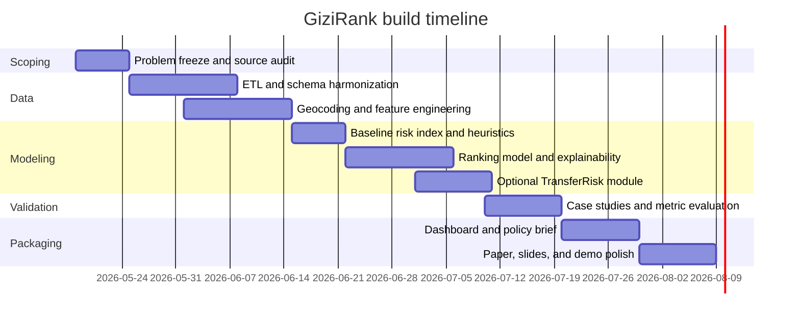

# KDD-Derivative Data Mining Ideas for GEMASTIK in Indonesia

## Executive summary

As of **14 May 2026**, MBG is already way past “concept-only” scale. Badan Gizi Nasional said the **2026 target is 82.9 million beneficiaries**, while its public operational directory showed **roughly 28,000 SPPG units** active around **13–14 May 2026**. On top of that, BGN publicly publishes MBG governance and food-safety guidance, and Kemendikdasmen exposes a public **Dashboard MBG** with recap tables for schools, beneficiaries, and learner characteristics. So, ngl, MBG-related ideas are no longer hand-wavy—they now sit on an actually usable public-data spine. citeturn19search1turn18search13turn18search14turn4search12turn4search6turn20search0

This matters because the current planning/fiscal narrative is also very aligned: **RPJMN 2025–2029** organizes development around **Asta Cita** and its **17 priority programs**, while Kemenkeu’s APBN 2025 framing explicitly names **MBG, food security, Sekolah Rakyat, Sekolah Unggul Garuda, and school revitalization** among programs with direct public impact. In plain terms: if you want a GEMASTIK idea that feels politically current but still academically legit, the strongest lanes are **MBG execution quality**, **food-security early warning**, **school vulnerability/risk**, and **transparent-but-safe procurement analytics**. citeturn5search2turn5search1

From the KDD side, the strongest derivative pattern is not “make an app,” but **turn a real policy problem into a crisp data-mining task with a measurable metric**. KDD Cup archives span **intrusion detection**, **student performance evaluation**, **click-through prediction**, **author disambiguation**, and **multilingual recommendation**, while KDD Cup 2024’s **CRAG** benchmark formalized evidence-grounded RAG evaluation. Platforms like DrivenData show the same shape for public-good work: **disease forecasting, water forecasting, and harmful-bloom detection** with clear targets and clear scoring. That’s the template that feels most winner-shaped here. citeturn8search0turn8search1turn8search8turn6search0turn7search1turn7search2turn9search0turn9search2turn9search12

My short take: **best all-rounder = GiziRank / MBGWatch**; **best safe fallback = PanganShield**; **best novelty add-on = TransferRisk**. **BelanjaGraph** and **GovMine-RAG** are very cool, but they are higher-friction and more presentation-sensitive. **SekolahRentan** and **EduRisk** are strong “clean, feasible, panel-friendly” options if you want lower controversy while staying aligned with school and human-capital priorities. That ranking comes from combining policy fit, public-data availability, and KDD-style evaluability against the official data stack now visible in BGN, Kemendikdasmen, BPS, Badan Pangan, LKPP, BMKG, and Satu Data Indonesia. citeturn18search14turn20search0turn1search1turn1search7turn1search3turn3search6turn2search0turn2search2turn2search1

## Context and scoring logic

The core KDD-style trick is simple: **one decision, one target, one metric**. If a project cannot clearly answer “what exact decision gets improved?” or “what metric proves it helped?”, it starts feeling like dashboard kosmetik. The table below maps global competition task families to Indonesian-localized project families that feel most relevant right now.

| KDD-style family | Official precedent | Indonesian localization that feels most hidup |
|---|---|---|
| Recommendation / ranking | KDD Cup 2023 multilingual recommendation | **GiziRank / MBGWatch**, **SekolahRentan** |
| Student prediction | KDD Cup 2010 student performance evaluation | **EduRisk**, **SekolahRentan** |
| Entity resolution | KDD Cup 2013 author disambiguation | **BelanjaGraph** |
| Intrusion / anomaly detection | KDD Cup 1999 intrusion detection | **BelanjaGraph**, **DapurAman** |
| Evidence-grounded retrieval / RAG benchmark | CRAG KDD Cup 2024 | **GovMine-RAG** |
| Public-good forecasting | DrivenData DengAI / Water Rodeo / Tick Tick Bloom | **PanganShield**, parts of **DapurAman** |

The precedents above come directly from official KDD and competition pages; the localizations are my analytical mapping. citeturn8search0turn8search1turn8search8turn6search0turn7search1turn7search2turn9search0turn9search2turn9search12

For this report, the **availability score** means: **5** = public, structured, and easy to reuse; **4** = public and structured but messy or multi-granularity; **3** = public but partial/manual/aggregated; **2** = exists but access-limited or unclear; **1** = mostly unavailable for a student prototype. **Overall feasibility** means “can a 3-person student team ship a convincing prototype + paper + demo in roughly 10–12 weeks?” That’s my judgment, not an official formula.

A quick reality check on the national data stack: public data is stronger than it looks. BGN exposes **FAQ, Juknis, food-safety pedoman, and a public SPPG directory**; Kemendikdasmen exposes **MBG recaps, school statistics, sanitation profiles, dropout/out-of-school, and APK/APM**; BPS exposes **district poverty publications and tables**; the stunting dashboard exposes **nutrition prevalence and intervention views**; FSVA maps **food vulnerability**; Badan Pangan and data.go.id expose **food prices, reserves, inter-regional trade, and food-safety indicators**; LKPP exposes **monitoring and SIRUP data**; BMKG publishes **open weather feeds**; Satu Data Indonesia provides a cross-agency discovery layer. The caveat: some official datasets still have mixed granularity, and some food/procurement datasets are clearly more open at summary level than at raw transactional level. citeturn4search1turn4search6turn18search14turn20search0turn15search11turn15search0turn22search2turn15search2turn1search1turn1search7turn1search16turn1search3turn3search6turn3search1turn21search0turn14search0turn2search0turn13search0turn2search2turn2search1

## Candidate portfolio

Before the per-idea breakdown, here is the **shared national source stack** you can reuse across multiple variants.

| Official stack | What it already gives you |
|---|---|
| BGN | FAQ on MBG scale and implementation, Juknis/pedoman, food-safety guidance, operational SPPG directory |
| Kemendikdasmen | Dashboard MBG, school statistics, participant counts, sanitation, APK/APM, dropout and out-of-school datasets |
| BPS | Poverty rates, poverty line, district/city poverty publication |
| dashboard.stunting.go.id | Stunting, wasting, underweight, and intervention views |
| FSVA / Badan Pangan / data.go.id | Food vulnerability, food prices, reserves, trade, food-safety indicators |
| LKPP / data.lkpp.go.id | Monitoring, SIRUP, e-katalog-oriented summaries, dataset registry/API notes |
| BMKG | Open weather forecasts and warnings |
| Supporting non-Indonesian official add-ons | Earth Engine, Landsat, MODIS for satellite proxies; GDELT for news-event mining |

Source basis for this stack: BGN, Kemendikdasmen, BPS, stunting dashboard, FSVA, Satu Data Indonesia/Badan Pangan, LKPP, BMKG, Earth Engine, USGS, NASA, and GDELT official pages. citeturn18search14turn20search0turn15search11turn22search2turn1search1turn1search7turn1search3turn3search6turn3search1turn21search0turn14search0turn2search0turn13search0turn2search2turn12search0turn12search1turn12search12turn11search0

**GiziRank / MBGWatch**  
*Pitch:* “Rank which districts or school clusters should get MBG monitoring first; jadi bukan dashboard doang, but a top-k action queue.”  
**Problem:** The real policy decision is where BGN, Kemendikdasmen, or pemda should send monitoring, kitchen support, or service expansion first. **Core task:** learning-to-rank, risk scoring, and spatial coverage-gap analysis. **Overall feasibility:** **4.6/5**. **Methods & novelty:** LightGBM/XGBoost ranking baseline, optional LambdaMART, SHAP, geospatial joins, and time-aware validation; the novelty is treating MBG as a **KDD-style ranking/recommendation** problem instead of a static welfare map. **Outputs:** merged kab/kota dataset, ranking model, explainability notebook, dashboard, and policy brief. **Evaluation:** Precision@K, Recall@K, NDCG@K, calibration, plus case-study validation against observed incident/coverage-gap areas. **Sensitivity:** medium; safest framing is **“monitoring prioritization and service-quality support”**, not “government failure detector.” **Team & timeline:** 3 people, CPU-friendly, 10–12 weeks. **Main risk:** weak labels; mitigate using proxy labels, expert review, and district-first aggregation. This idea is especially practical because MBG-specific supply and demand signals are now public from BGN and Kemendikdasmen, while poverty, nutrition, food-vulnerability, and weather covariates already exist in official portals. citeturn18search14turn20search0turn1search7turn1search2turn1search1turn1search3turn3search6turn2search2

| Dataset / source | Why it matters | Avail. | Assumption |
|---|---|---:|---|
| BGN SPPG operasional citeturn18search0turn18search14 | Supply-side coverage, density, nearest-SPPG features | 5 | Geocode/aggregate addresses to district or school-cluster level |
| Dashboard MBG Kemendikdasmen citeturn20search0turn20search4turn20search5 | Current program coverage, satpen and beneficiary recap | 4 | Public recap is usable; deeper API access unspecified |
| dashboard.stunting.go.id citeturn1search7turn1search10 | Need-side nutrition risk | 5 | Harmonize year differences with live program data |
| Peserta didik + sanitasi Kemendikdasmen citeturn1search2turn15search11turn15search9 | Student exposure and school readiness | 5 | Prefer kab/kota or province joins first |
| BPS poverty + FSVA + food prices/cadangan citeturn1search1turn1search3turn3search6turn3search1 | Socioeconomic and food-stress risk layers | 4 | Mixed annual vs monthly granularity |
| BMKG weather + GDELT/news optional citeturn2search2turn11search0turn11search11 | Shock and incident signals | 4 | API/query limits unspecified |

**TransferRisk**  
*Pitch:* “Make the model work in low-data 3T / remote regions; jadi fairer, not Java-centric doang.”  
**Problem:** High-need districts with thin data are exactly the places that ordinary models under-serve. **Core task:** transfer learning, domain adaptation, hierarchical modeling, and uncertainty estimation. **Overall feasibility:** **3.8/5**. **Methods & novelty:** multi-task learning across provinces, graph-based feature propagation, missing-data-robust boosting, or hierarchical Bayesian baselines; the novelty is localizing the **KDD 2023 underrepresented locales** idea to Indonesia’s low-data/remote districts. **Outputs:** transfer-aware baseline, uncertainty map, fairness gap report, reuseable training pipeline. **Evaluation:** leave-one-region-out validation, performance gap between data-rich vs low-data areas, uncertainty coverage, and subgroup calibration. **Sensitivity:** low; this is easy to frame as equitable model design. **Team & timeline:** 3 people, stronger ML/statistics needed, 10–12 weeks. **Main risk:** proving transfer actually helps; mitigate with strict ablations and a simpler GiziRank baseline. This idea becomes strongest when paired with MBG or education risk, and official low-development/lagging-area proxies already exist through Kemendesa’s **Indeks Komposit Ketertinggalan** and **IDM**, alongside the usual MBG/nutrition/poverty stack. citeturn6search0turn24search2turn24search3turn18search14turn20search0turn1search7turn1search1turn1search3

| Dataset / source | Why it matters | Avail. | Assumption |
|---|---|---:|---|
| GiziRank base stack: BGN + Kemendikdasmen + stunting + BPS + FSVA citeturn18search14turn20search0turn1search7turn1search1turn1search3 | Core covariates and labels | 4 | Reuse ranking/risk pipeline from base task |
| IDM 2024 citeturn24search3turn24search13 | Rurality / development status / low-data proxy | 4 | Need aggregation from village to district if mixed units |
| Indeks Komposit Ketertinggalan citeturn24search2turn24search12 | Lagging-area indicator for transfer groups | 4 | Coverage and schema cleaning required |
| BMKG or satellite supplements citeturn2search2turn12search0turn12search1 | Stabilize prediction where admin data is sparse | 4 | Non-Indonesian satellite source is a supplement, not core |

**GovMine-RAG**  
*Pitch:* “Evidence-grounded policy QA for MBG and public programs; chatbotnya harus cite sources, no halu vibes.”  
**Problem:** Analysts, jurors, and even agencies often struggle to pull coherent evidence across BGN guidance, planning documents, and multi-agency datasets. **Core task:** document retrieval, evidence ranking, entity linking, knowledge-graph construction, and RAG evaluation. **Overall feasibility:** **3.2/5**. **Methods & novelty:** BM25 + dense retrieval hybrid, citation-grounded answer synthesis, KG over program-region-dataset entities, and human-checked benchmark questions; the novelty is localizing **CRAG-style** evaluation to Indonesian policy/program data. **Outputs:** benchmark dataset, retriever, evidence store, KG, demo, and factuality rubric. **Evaluation:** Recall@K for evidence, citation accuracy, faithfulness, answer exactness, and human review. **Sensitivity:** medium; safe framing is **“evidence retrieval assistant”**, not “AI policy oracle.” **Team & timeline:** 3 people, one GPU helps but not mandatory if you keep models lean, 10–12 weeks. **Main risk:** label creation is heavy; mitigate with a small but high-quality benchmark and narrow scope around MBG/food/education. This is feasible because BGN, Bappenas/Kemenkeu, data.go.id, LKPP, and JDIHN all publish relevant documents or portals—but the work is mostly in retrieval quality and evaluation design. citeturn7search1turn7search2turn4search12turn5search2turn5search1turn2search1turn2search5turn2search0turn25search18turn25search14

| Dataset / source | Why it matters | Avail. | Assumption |
|---|---|---:|---|
| BGN FAQ / Juknis / pedoman citeturn4search1turn4search12turn4search6 | MBG source-of-truth docs | 4 | PDFs/HTML must be chunked and normalized |
| RPJMN + APBN pages citeturn5search2turn5search1 | Planning and fiscal context | 4 | PDF parsing and metadata curation needed |
| Satu Data + BPS + Kemendikdasmen + LKPP citeturn2search1turn1search1turn15search11turn2search0 | Structured evidence tables | 4 | Schema harmonization across agencies |
| JDIHN / legal docs citeturn25search18turn25search14 | Regulation corpus | 3 | Scope should be narrowed to relevant laws/regulations |
| News / GDELT optional citeturn11search0turn11search11 | Recency layer for public events | 3 | Keys/rate limits unspecified |

**BelanjaGraph**  
*Pitch:* “Graph anomaly mining for procurement patterns; framing-nya audit support, bukan nuduh korupsi.”  
**Problem:** Procurement teams and auditors need early-warning triage: which commodity-region-package patterns deserve review first? **Core task:** entity resolution, graph mining, anomaly detection, and price benchmarking. **Overall feasibility:** **2.9/5**. **Methods & novelty:** fuzzy vendor matching, graph embeddings, community detection, Benford-style checks, Isolation Forest/LOF, and commodity/region benchmarking. The KDD derivative is clean: **author disambiguation + anomaly detection** localized to public procurement. **Outputs:** anomaly typology, graph explorer, ranked package-risk list, reproducible notebook. **Evaluation:** anomaly precision on reviewed samples, synthetic anomaly injection, benchmark against commodity-price references, and expert sanity review. **Sensitivity:** high; safest wording is **“indikasi anomali untuk prioritas audit awal”**. **Team & timeline:** 3 people, heavy data cleaning, 10–12 weeks. **Main risk:** public data appears stronger for summaries than for raw vendor-transaction graphs; mitigate by narrowing to one commodity family or staying at aggregate institutional pattern level. LKPP’s public portal clearly exposes monitoring and SIRUP datasets plus registry/API notes, but the visible open-data layer looks much better for **planning/monitoring values** than for perfect package-vendor granularity. citeturn8search0turn2search0turn2search4turn13search0turn13search12turn13search3turn21search1

| Dataset / source | Why it matters | Avail. | Assumption |
|---|---|---:|---|
| LKPP monitoring datasets citeturn2search0turn2search12 | Institution and regional procurement values | 4 | Mostly monitoring/summary oriented |
| SIRUP / RUP data citeturn13search0turn13search12 | Planned package values and metadata | 4 | Good for planned-spend patterns, not full vendor graph |
| LKPP registry/API notes citeturn2search4turn2search15 | Discoverability and structured access | 4 | Endpoint coverage may vary by dataset |
| e-katalog / product-summary signals citeturn2search0turn13search3 | Price and category context | 3 | Product-level open granularity may be uneven |
| Badan Pangan price references citeturn21search1turn21search2 | Commodity reference bands | 4 | Join by proxy commodity group |

**PanganShield**  
*Pitch:* “Forecast where food stress will spike next; cocok banget buat ketahanan pangan dan stabilisasi harga.”  
**Problem:** The policy decision is where to prioritize reserves, distribution support, or market stabilization before food stress gets ugly. **Core task:** spatio-temporal forecasting, risk classification, and hotspot ranking. **Overall feasibility:** **4.2/5**. **Methods & novelty:** gradient boosting plus lag features, quantile forecasting, spatial clustering, and optional satellite vegetation/moisture proxies. The novelty is a **DrivenData-style public-good forecasting** stack using Indonesian food-security data rather than generic inflation dashboards. **Outputs:** monthly risk forecast, shock-explainer notebook, dashboard, and policy memo for reserve/distribution prioritization. **Evaluation:** MAE/RMSE or pinball loss for forecasts, early-warning hit rate, and top-K hotspot accuracy. **Sensitivity:** low; safest of the whole list. **Team & timeline:** 3 people, mostly CPU-friendly, 8–10 weeks. **Main risk:** mixed temporal granularity; mitigate by fixing one unit first, ideally province or kab/kota monthly. This is strong because FSVA, food prices, reserves, trade, weather, and even satellite add-ons are all publicly accessible, though some agency-level Badan Pangan datasets are more open on data.go.id than on the agency portal itself. citeturn1search3turn3search6turn3search1turn21search0turn21search1turn2search2turn12search0turn12search1turn3search4

| Dataset / source | Why it matters | Avail. | Assumption |
|---|---|---:|---|
| FSVA citeturn1search3 | Structural food-vulnerability map | 4 | Best used as baseline structural layer |
| Food prices / volatility citeturn3search6turn21search1turn21search2 | Stress and affordability signal | 4 | Monthly joins only |
| Cadangan pangan + trade flows citeturn3search1turn3search5turn21search0 | Supply and movement proxies | 4 | Some detailed versions remain mixed/open-limited |
| BMKG forecasts / warnings citeturn2search2turn2search17 | Weather shock covariates | 5 | Regional aggregation needed |
| Earth Engine / Landsat / MODIS citeturn12search0turn12search1turn12search12 | Vegetation and climate proxies | 5 | Non-Indonesian official supplement |

**SekolahRentan**  
*Pitch:* “Rank sekolah or district school clusters that most need integrated nutrition-sanitation support; very panel-friendly, very clear.”  
**Problem:** If school-support budgets are limited, where should sanitation, nutrition monitoring, or MBG readiness support go first? **Core task:** vulnerability ranking, clustering, and spatial prioritization. **Overall feasibility:** **4.4/5**. **Methods & novelty:** multi-criteria ranking, hierarchical clustering, explainable tree models, and optional accessibility analysis to nearest SPPG. The novelty is shifting from broad district welfare talk to a **school-service vulnerability lens**. **Outputs:** school/district risk index, map, explainability sheet, and targeted intervention brief. **Evaluation:** Precision@K against poor-sanitation/high-dropout areas, cluster stability, and cross-checks with MBG/stunting patterns. **Sensitivity:** low–medium; this frames nicely as service-targeting support. **Team & timeline:** 3 people, CPU-friendly, 8–10 weeks. **Main risk:** clean school-level geocoding may be incomplete in public extracts; mitigate by starting at kab/kota or school-cluster level. This idea is highly feasible because Kemendikdasmen already publishes school statistics, sanitation profiles, participant counts, and out-of-school data, while MBG, poverty, stunting, and SPPG coverage can be layered in. citeturn15search11turn15search0turn22search2turn22search6turn20search0turn1search1turn1search7turn18search14

| Dataset / source | Why it matters | Avail. | Assumption |
|---|---|---:|---|
| Statistik sekolah + profil sanitasi citeturn15search11turn15search0turn15search1 | Core readiness and infrastructure variables | 5 | Start at regional aggregation if school coordinates are messy |
| Peserta didik + MBG dashboard citeturn1search2turn20search0turn20search4 | Exposure and program coverage | 5 | Satpen/bene count joins need consistent unit definitions |
| Out-of-school / dropout datasets citeturn22search2turn22search6turn22search8 | Outcome/risk labels | 5 | Some tables vary by format/version |
| BPS poverty + stunting + SPPG access citeturn1search1turn1search10turn18search0 | Social and nutrition context | 5 | District-first is the safest first prototype |

**DapurAman**  
*Pitch:* “Food-safety early warning for MBG kitchens; better framed as inspection priority, bukan ‘unsafe kitchen list’.”  
**Problem:** Safety resources are limited, so where should inspections, retraining, or kitchen support go first to reduce the next incident? **Core task:** incident mining, anomaly detection, weakly supervised risk classification, and event extraction from news/public signals. **Overall feasibility:** **3.6/5**. **Methods & novelty:** keyword/event extraction over news, positive-unlabeled learning, temporal spike detection, and risk scoring with weather/logistics/environment features. The novelty is combining **incident text mining** with official program/kitchen context. **Outputs:** incident signal pipeline, inspection-priority score, timeline dashboard, and safety-focused policy brief. **Evaluation:** time-split precision/recall on reported incidents, lead-time gains, and regional case studies. **Sensitivity:** medium–high; safest wording is **“prioritas pengawasan keamanan pangan”**, not accusation or kitchen blacklisting. **Team & timeline:** 3 people, NLP-heavy, 10–12 weeks. **Main risk:** kitchen-level certification/incident labels are sparse and media-biased; mitigate with province/kab aggregation, manual validation, and explicit uncertainty labels. This idea is legit because BGN now requires food-safety standards and certification logic for SPPG, and major 2025 reporting documented repeated poisoning incidents during rollout. citeturn4search6turn4search15turn4search3turn18search14turn17news24turn17news25turn2search2turn11search0

| Dataset / source | Why it matters | Avail. | Assumption |
|---|---|---:|---|
| BGN SPPG directory + food-safety guidance citeturn18search14turn4search6turn4search3 | Kitchen universe and standard reference | 4 | Unit-level certification status is not fully open |
| Food-safety indicators on data.go.id citeturn14search0turn14search1turn14search10 | Regional safety-context proxies | 3 | Mostly contextual, not direct kitchen outcomes |
| GDELT / News API / reputable news citeturn11search0turn11search11turn17news24turn17news25 | Incident/event labels | 4 | Paid keys / query scope may constrain volume |
| BMKG weather warnings citeturn2search2turn2search17 | Spoilage/distribution risk covariates | 5 | Aggregate to district/province |
| LAPOR optional citeturn16search1 | Public complaint supplement | 2 | Public export/API scope is unclear on the public site |

**EduRisk**  
*Pitch:* “Predict which districts are most at risk of dropout or weak educational participation under nutrition-poverty-sanitation stress.”  
**Problem:** Planning teams need to know where education support is most urgent before participation or completion declines further. **Core task:** classification, ranking, and subgroup risk profiling. **Overall feasibility:** **4.3/5**. **Methods & novelty:** tabular boosting, calibrated classifiers, what-if analysis, fairness checks, and optional temporal trend modeling. The novelty is integrating **nutrition and sanitation** into an education-risk model rather than treating education in isolation. **Outputs:** district risk score, model card, policy memo, and explainability dashboard. **Evaluation:** AUC, F1, Precision@K, calibration, and subgroup fairness gaps. **Sensitivity:** low–medium; safest wording is **“prioritas dukungan pendidikan”**. **Team & timeline:** 3 people, CPU-friendly, 8–10 weeks. **Main risk:** ecological fallacy if you model at district level; mitigate by clearly stating unit-of-analysis limits and avoiding individual prediction claims. This project is very feasible because Kemendikdasmen already publishes dropout, out-of-school, participant, APK/APM, and sanitation datasets, while BPS poverty and stunting can serve as strong contextual covariates. citeturn22search2turn22search6turn22search8turn15search2turn15search11turn1search1turn1search7

| Dataset / source | Why it matters | Avail. | Assumption |
|---|---|---:|---|
| Dropout / out-of-school datasets citeturn22search2turn22search6turn22search12 | Main target variables | 5 | Prefer district or province aggregation |
| APK / APM + participant counts citeturn15search2turn1search2 | Participation/coverage context | 5 | Align school-year periods carefully |
| School statistics + sanitation citeturn15search11turn15search0 | Infrastructure and readiness drivers | 5 | Public data is strong enough for first prototype |
| BPS poverty + stunting + optional MBG context citeturn1search1turn1search7turn20search0 | Socioeconomic and nutrition stress | 4 | MBG as contextual, not necessarily causal |

## Ranking comparison

Using the user-specified weights — **Impact 30%, Feasibility 25%, Uniqueness 20%, Political Fit 25%** — the shortlist lands like this. This table is my analytical scoring, but it is grounded in the public-data and policy-fit evidence above.

| Idea | Impact | Feasibility | Uniqueness | Political Fit | Overall score | Read |
|---|---:|---:|---:|---:|---:|---|
| GiziRank / MBGWatch | 5.0 | 4.5 | 4.2 | 4.8 | **4.67** | Best all-rounder |
| PanganShield | 4.6 | 4.2 | 4.0 | 4.7 | **4.41** | Safest strong backup |
| TransferRisk | 4.4 | 3.8 | 4.8 | 4.5 | **4.36** | Best novelty add-on |
| SekolahRentan | 4.2 | 4.4 | 3.8 | 4.5 | **4.25** | Very panel-friendly |
| DapurAman | 4.5 | 3.6 | 4.4 | 4.0 | **4.13** | Timely but label-hard |
| EduRisk | 4.0 | 4.3 | 3.6 | 4.4 | **4.10** | Clean and feasible |
| GovMine-RAG | 4.0 | 3.2 | 4.6 | 4.2 | **3.97** | Cool but evaluation-heavy |
| BelanjaGraph | 4.5 | 2.9 | 4.7 | 3.0 | **3.77** | Technically spicy, politically hottest |

If you want a slide that hits fast, a **radar chart** comparing the top four ideas across the four scoring dimensions would slap here: it will visually show that **GiziRank** dominates on **Impact + Political Fit** without sacrificing too much feasibility, while **PanganShield** is the safest broad-policy option and **TransferRisk** wins on uniqueness.

## Recommended path

My recommended **final choice** is **GiziRank / MBGWatch**, ideally with a **small TransferRisk module** as the novelty layer. Why? Because it has the cleanest combo of: **current-regime policy fit**, **public MBG-specific data**, **clear KDD-style ranking metrics**, and **easy-to-explain outputs**. BGN now exposes both the governance side and the operational SPPG side, while Kemendikdasmen exposes MBG recap tables and school-side data. Add stunting, poverty, FSVA, prices, and weather, and you suddenly have a full decision-support stack yang legit banget. citeturn18search14turn20search0turn1search7turn1search2turn1search1turn1search3turn3search6turn2search2

If you want a **safer fallback** with less sensitivity and less label drama, choose **PanganShield**. It aligns tightly with current food-security priorities, and the data stack is mature enough that your main work becomes modeling + storytelling, not hunting for data. If your team wants to look more novel without getting dragged into procurement sensitivity or full RAG complexity, the best move is to present **TransferRisk as a bonus research question inside GiziRank**, not as the standalone main project. citeturn5search1turn1search3turn3search1turn3search6turn21search0turn21search1turn2search2

For the top idea, a very workable feature set looks like this:

| Feature family | Example variables |
|---|---|
| Nutrition need | stunting, wasting, underweight prevalence |
| Education exposure | number of schools, participants by jenjang, sanitation status, out-of-school or dropout counts |
| Program supply | operational SPPG count, SPPG density per student, MBG beneficiary count, satpen coverage |
| Socioeconomic stress | poverty rate, poverty line, village/development status if relevant |
| Food-system stress | price level, price volatility, reserve/cadangan, food-vulnerability class, trade-flow proxy |
| Environment and shock | weather warnings, rainfall/temperature proxy, remoteness or island dummy |
| Public signal | news-incident counts, recency of complaints or event mentions |

These features are directly motivated by the official source stack in BGN, Kemendikdasmen, BPS, stunting dashboard, FSVA, Badan Pangan, and BMKG. citeturn18search14turn20search0turn15search11turn22search2turn1search1turn1search7turn1search3turn3search6turn3search1turn2search2

A proposal-ready GEMASTIK outline could look like this:

- **Title:** *GiziRank: KDD-Style Risk Ranking for Prioritizing MBG Monitoring and Support in Indonesia*.
- **Objective:** build a district-level ranking system that tells policymakers where MBG supervision, support, or expansion should go first.
- **Datasets:** BGN SPPG operasional, Dashboard MBG Kemendikdasmen, stunting dashboard, Kemendikdasmen school/sanitation/out-of-school data, BPS poverty, FSVA, Badan Pangan price/reserve data, BMKG weather.
- **Methods:** feature engineering, geospatial joins, baseline weighted risk index, LightGBM/XGBoost ranking, SHAP explainability, optional TransferRisk module for low-data districts.
- **Deliverables:** cleaned integrated dataset, reproducible notebook, ranked district list, explainability dashboard, short policy brief, and final paper/presentation demo.
- **Evaluation:** Precision@K, NDCG@K, Recall@K, calibration, ablation tests, and 3–5 case studies comparing model outputs with observed MBG coverage gaps or incident patterns.
- **Safety framing:** “prioritization support for program quality and efficiency,” explicitly **not** corruption detection and **not** naming individual kitchens as unsafe.
- **Timeline:** around 10 weeks from data audit to final demo, with dashboard as presentation layer—not the core scientific contribution.

## Timeline and metric playbook

A realistic build plan for the recommended project could be:

The most useful **evaluation formulas** for a GiziRank-style project are these:

\[
\text{Precision@K}=\frac{|TopK_{pred}\cap TopK_{ref}|}{K}
\]

\[
\text{Recall@K}=\frac{|TopK_{pred}\cap TopK_{ref}|}{|TopK_{ref}|}
\]

\[
DCG@K=\sum_{i=1}^{K}\frac{2^{rel_i}-1}{\log_2(i+1)}, \qquad
NDCG@K=\frac{DCG@K}{IDCG@K}
\]

\[
\text{MRR}=\frac{1}{|Q|}\sum_{q\in Q}\frac{1}{rank_q}
\]

A few practical derived features also help the story land faster:

\[
\text{CoverageGap}_i = 1 - \frac{\text{MBG beneficiaries}_i}{\text{eligible students}_i}
\]

\[
\text{SPPGDensity}_i = \frac{\text{operational SPPG}_i}{10{,}000 \text{ students}_i}
\]

\[
\text{PriceStress}_i = z(\text{food price level}) + z(\text{price volatility})
\]

For visualization, the most useful set would be:

| Suggested chart | What it shows |
|---|---|
| Radar chart | Compare top 4 ideas across Impact, Feasibility, Uniqueness, Political Fit |
| Choropleth map | Top-risk districts and MBG coverage gaps |
| Lift / gain chart | Whether the ranking beats a naive baseline |
| SHAP summary plot | What features drive high-risk ranking |
| Time-series alert chart | If you add DapurAman-style incident signals |

Final practical note: if you want the proposal to feel **sharp but safe**, phrase the project as **helping the government allocate scarce monitoring capacity under a large national priority program**. That framing is much stronger—and much less politically brittle—than pitching it as “finding failures” or “exposing bad actors.” The official data and planning context already support the first framing very well. citeturn5search1turn5search2turn18search14turn20search0turn2search1