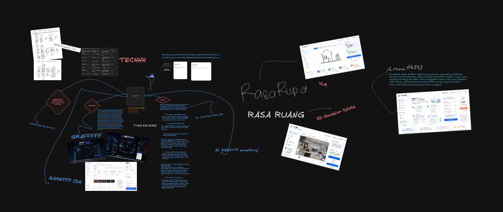

# GEMASTIK Workspace

This repository is a working archive for GEMASTIK preparation, research, proposal drafting, and demo prototyping. It collects material for several competition tracks, especially Cyber Security, Data Mining, and Pengembangan Perangkat Lunak.

GEMASTIK is a national student competition in information and communication technology. This workspace is organized as a practical build space: notes, playbooks, proposal drafts, mockups, generated visuals, and runnable demo applications live together so the team can compare ideas and keep improving them.



## Repository Map

| Track | Folder | Contents |
| --- | --- | --- |
| Cyber Security | `CTF - Cyber Security/` | Deep-research style reference PDF for CTF / cyber preparation. |
| Data Mining | `DATA MINING - Penambangan Data/` | Data mining playbook, judging criteria references, and screenshots. |
| Software Development | `SOFTWARE - Pengembangan Perangkat Lunak/` | GEMASTIK software proposal concepts, DOCX/PDF drafts, visual assets, and Vite/React demo apps. |

## Main Software Concepts

### JudolGraph

**JudolGraph** is an AI-powered investigation graph platform for exposing and documenting online gambling networks using synthetic demo data. The core workflow is:

1. Detect scattered digital traces such as domains, mirror domains, Telegram channels, payment clues, screenshots, and OCR text.
2. Connect those traces into an evidence graph.
3. Document findings through timelines, entity profiles, evidence tables, and export-ready reports.

The project includes a full context pack and a runnable Vite + React + TypeScript demo web app.

Key files:

- `SOFTWARE - Pengembangan Perangkat Lunak/JudolGraph/JUDOLGRAPH_DEMO_WEBSITE_CONTEXT.md`
- `SOFTWARE - Pengembangan Perangkat Lunak/JudolGraph/GEMASTIK_XVIII_Perangkat_Lunak_IDTim_ajarin kami sepuh_JudolGraph_Proposal.docx`
- `SOFTWARE - Pengembangan Perangkat Lunak/JudolGraph/GEMASTIK_XVIII_Perangkat_Lunak_IDTim_ajarin kami sepuh_JudolGraph_Proposal.pdf`
- `SOFTWARE - Pengembangan Perangkat Lunak/JudolGraph/demo-web/`


### AmanAkses

**AmanAkses** is an accessible digital support platform for people with disabilities to understand sexual violence, document events and evidence safely, prepare a chronology, and share an initial report only with trusted companions or authorized support institutions based on user consent.

The demo emphasizes accessibility, privacy, evidence handling, consent-based sharing, and survivor-centered interaction.

Key files:

- `SOFTWARE - Pengembangan Perangkat Lunak/AmanAkses/GEMASTIK_XVIII_Perangkat_Lunak_IDTim_ajarin_kami_sepuh_AmanAkses_Proposal.docx`
- `SOFTWARE - Pengembangan Perangkat Lunak/AmanAkses/GEMASTIK_XVIII_Perangkat_Lunak_IDTim_ajarin_kami_sepuh_AmanAkses_Proposal.pdf`
- `SOFTWARE - Pengembangan Perangkat Lunak/AmanAkses/demo-web/`


.png>)

### SajiAman

**SajiAman** is an AI Food Safety & Traceability Platform for the Program Makan Bergizi Gratis (MBG). It is designed to support food safety monitoring, meal batch tracking, distribution monitoring, student symptom reporting, and leftover evaluation.

The proposal positions SajiAman as an operational decision-support and documentation system for kitchens, schools, distribution teams, supervisors, health offices, and health centers.

Key files:

- `SOFTWARE - Pengembangan Perangkat Lunak/SajiAman/GEMASTIK_XVIII_Perangkat_Lunak_ajarin_kami_sepuh_SajiAman_Proposal.docx`
- `SOFTWARE - Pengembangan Perangkat Lunak/SajiAman/GEMASTIK_XVIII_Perangkat_Lunak_ajarin_kami_sepuh_SajiAman_Proposal.pdf`


.png>)

### SIKAP / Policy Hacking

**SIKAP** stands for Sistem Simulasi Kebijakan dan Analisis Publik. It is a policy-as-code platform for simulating, red-teaming, and debugging public policy before implementation.

The initial case study is KIP Kuliah. SIKAP converts natural-language policy text into structured rules, runs simulations on synthetic populations, identifies implementation risks, and produces explainable recommendations.

Key files:

- `SOFTWARE - Pengembangan Perangkat Lunak/PolicyHacking/Proposal_GEMASTIK_PPL_SIKAP_Ajarin_Kami_Sepuh.docx`
- `SOFTWARE - Pengembangan Perangkat Lunak/PolicyHacking/Proposal_GEMASTIK_PPL_SIKAP_Ajarin_Kami_Sepuh.pdf`

.png>)

.png>)

### WarungPilot

**WarungPilot** currently appears as an early visual concept inside the software development track.


## Data Mining References

The data mining folder contains a compact playbook and judging-criteria visuals for preparing a stronger GEMASTIK data mining submission.

Key files:

- `DATA MINING - Penambangan Data/Winner-Level GEMASTIK Data Mining Playbook-1.pdf`
- `DATA MINING - Penambangan Data/Kriteria Penilaian.png`
- `DATA MINING - Penambangan Data/Screenshot 2026-05-08 144520.png`
- `DATA MINING - Penambangan Data/Screenshot 2026-05-08 144604.png`


## Judging References

The software track also includes judging reference material used to align proposal and prototype work with competition criteria.


## Running Demo Apps

Two software concepts currently have runnable web demos.

### JudolGraph Demo

```powershell
cd "SOFTWARE - Pengembangan Perangkat Lunak\JudolGraph\demo-web"
pnpm install
pnpm dev
```

Open the local Vite URL printed by the terminal, usually:

```txt
http://localhost:5173/
```

### AmanAkses Demo

```powershell
cd "SOFTWARE - Pengembangan Perangkat Lunak\AmanAkses\demo-web"
pnpm install
pnpm dev
```

Open the local Vite URL printed by the terminal.

## Recommended Presentation Order

For a software-development pitch, the strongest story is:

1. Start with the problem and social impact.
2. Show the proposal PDF/DOCX to establish formal GEMASTIK alignment.
3. Open the demo app.
4. Walk through the main workflow.
5. Show the visual assets and explain the planned interface direction.
6. Close with the judging criteria and how the project satisfies them.

For JudolGraph specifically:

1. Landing page.
2. Dashboard.
3. Evidence Graph.
4. Entity Detail.
5. Screenshot & OCR Evidence.
6. Report Export.
7. Mobile Preview.

## Notes

- Demo data should remain synthetic.
- Proposal files may still contain placeholders for team identity, supervisor data, video links, and deployment URLs.
- Generated images are stored as visual exploration assets and can be narrowed down when preparing final proposal pages or slides.
- The root repository is an idea and preparation workspace, not a single monolithic application.
